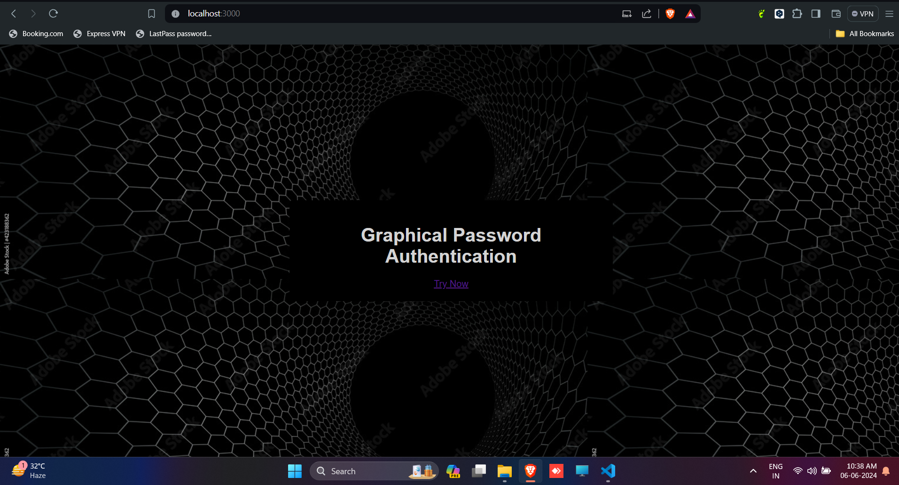
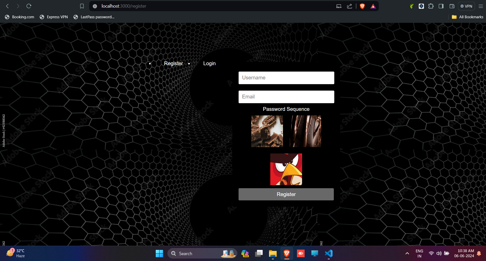
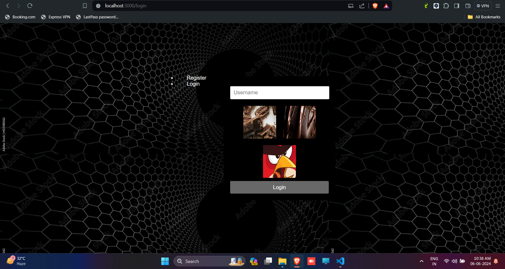
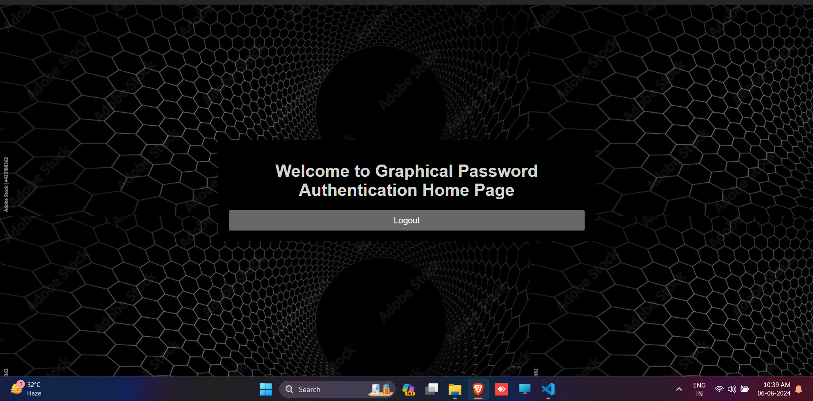

# Project Title

Graphical Password Authentication System

## Description

The Graphical Password Authentication System is a secure and user-friendly login system that replaces traditional text passwords with graphical patterns. It aims to enhance security and usability by leveraging visual memory for authentication.

## Features

- Secure authentication using graphical patterns
- Intuitive user interface for creating and logging in with graphical passwords
- Protection against common attacks like brute force and phishing
- Customizable password patterns for users

## Installation

1. Clone the repository:
   ```bash
   git clone https://github.com/theneoalpha/graphical_password_authentication

2. Navigate the directory
    cd graphical_password_authentication

3. Install dependencies:
    npm install


4. Start the server:
    cd server
    npm run start
    
  

5. Start the frontend:
    cd ..
    cd frontend
    npm run start
    Open your web browser and navigate to http://localhost:3000.
    Follow the on-screen instructions to create and log in with graphical passwords.


## Contributing
    Contributions are welcome! If you'd like to contribute to the Graphical Password Authentication System, please follow these steps:

1. Fork the repository.

2. Create a new branch:
     git checkout -b feature/your-feature

3. Make your changes and commit them:
    git commit -am 'Add your feature'

4.  Push to the branch:
git push origin feature/your-feature

5. Submit a pull request.

## License
   This project is licensed under the MIT License - see the LICENSE file for details.

## Contact
    For questions or feedback, feel free to reach out to me at vikashkaushik910@gmail.com.


## Screenshots

    

    

    

    

    

